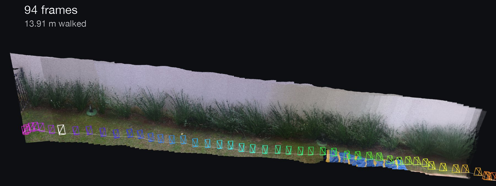
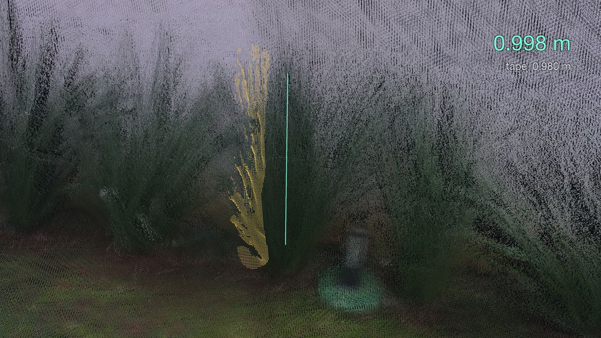
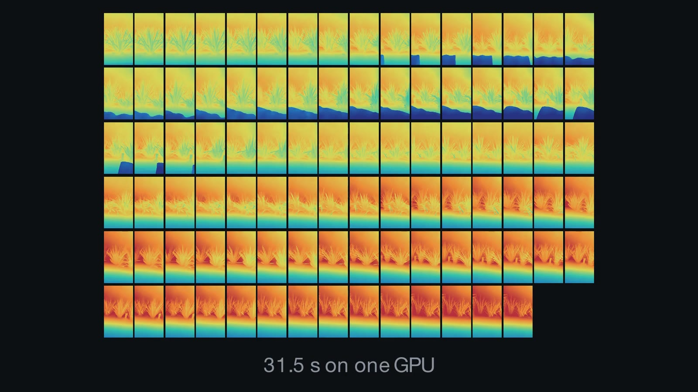
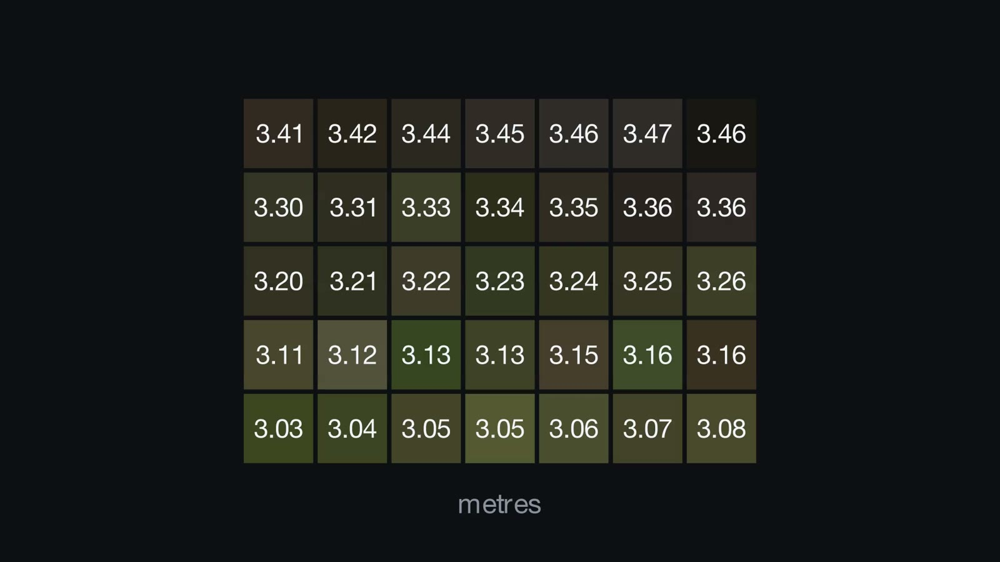
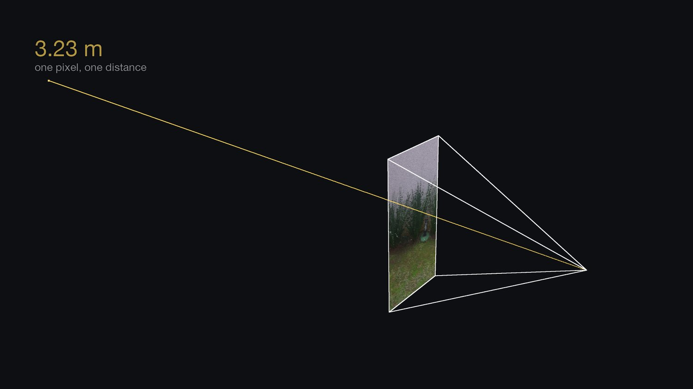
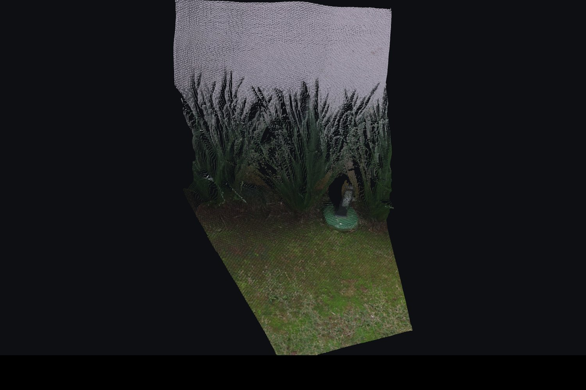
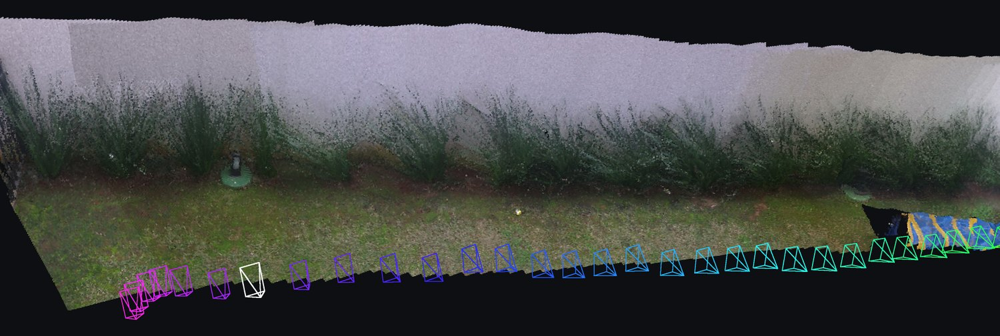
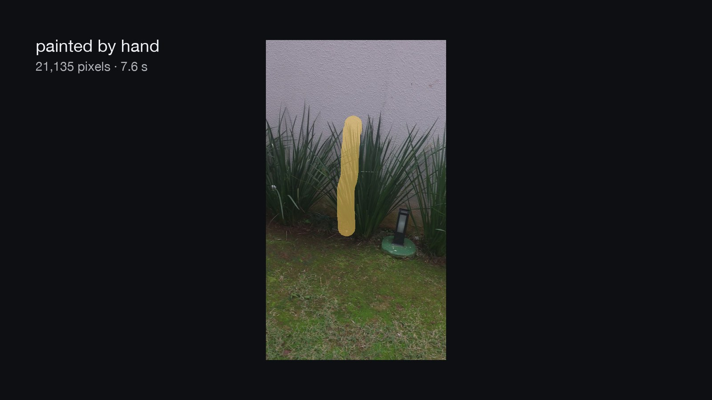
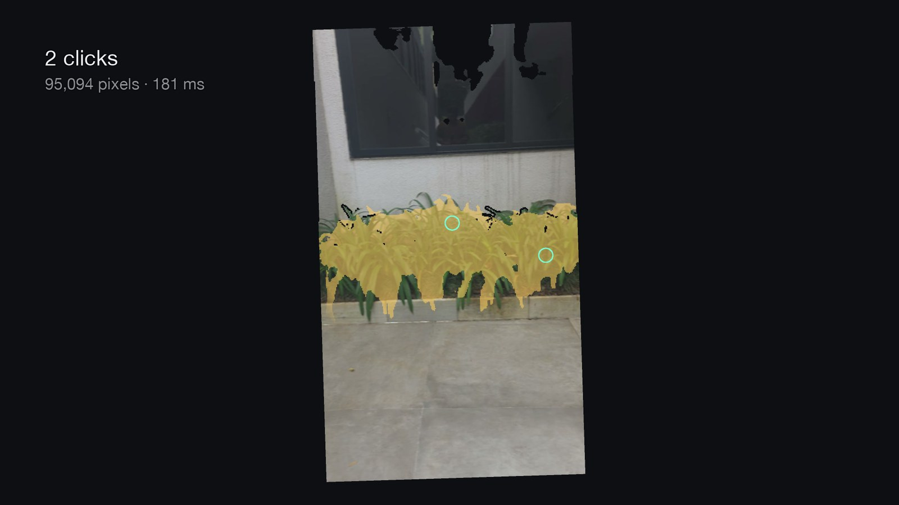
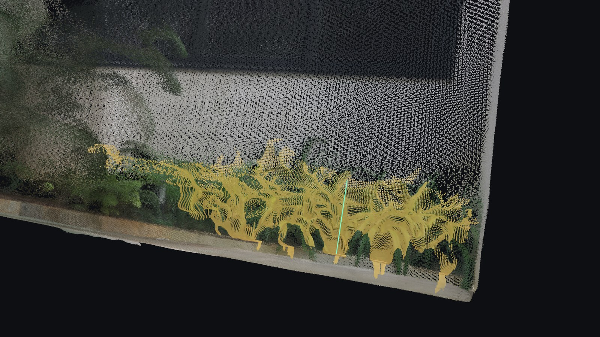

# Verge Studio

[](https://github.com/henrikmm/verge-studio/actions/workflows/local-verification.yml)

**Measure real-world heights from an ordinary phone video.** No lidar, no depth sensor, no markers
in the scene — just a clip, walked past the thing you want to measure.



<sub>A 19-second phone clip, reconstructed. The coloured chain is the camera's own path, recovered
from the footage alone — 13.91 m of it. Everything in this README is rendered from real runs of
this pipeline; nothing is an illustration.</sub>

---

## The result

A clumping plant in that garden, taped at **0.980 m**. The reconstruction reads **0.998 m** —
without anything in the scene telling it what a metre is.



Ten targets across four reconstructions have been graded against a tape measure. These are the
eight with repeat trials. Every row is replayed from its frozen mask rather than copied from a
record — `node scripts/collect-evidence.mjs` rebuilds the whole table in about a minute.

| Clip | Target | Truth | Read | Error | Spread |
|---|---|---:|---:|---:|---:|
| RoomNewFixture | PC tower | 0.440 m | 0.4455 m | **+1.3%** | 6.2 mm |
| RoomNewFixture | Table | 0.730 m | 0.7324 m | **+0.3%** | 11.1 mm |
| RoomNewFixture | Monitor | 0.430 m | 0.4286 m | **−0.3%** | 3.1 mm |
| Test_Grass2 | Clumping plant | 0.980 m | 0.9983 m | **+1.9%** | 15.5 mm |
| Test_Grass2 | Garden light | 0.300 m | 0.3005 m | **+0.2%** | 7.2 mm |
| test-demo-door | Door leaf | 2.100 m | 2.0184 m | −3.9% | 5.9 mm |
| test-demo-door | Table | 0.750 m | 0.6971 m | −7.0% | 4.1 mm |
| test-demo-door | Tower | 0.450 m | 0.4276 m | −5.0% | 0.9 mm |

<sub>Three independently repainted trials each; spread is repeatability within one sitting, not
uncertainty. Two further targets measured with an automatic mask (+5.6%, −7.3%) are single trials
and are discussed under *What this does not establish*.</sub>

**Accuracy is a property of the clip, not a constant of the system.** The same code reads 3.9–7.0%
low on the door clip and within 2% on both clips captured later. Nothing in the measurement path
changed between them; the capture did. That gap is the project's largest open question, and it is
stated rather than smoothed over.

---

## How it works

### 1 — Frames go to the model together, not one at a time

A depth model that sees images one at a time produces depth maps that do not fit together. This
one compares many views of the same scene, which is what makes the geometry usable — and why the
input has to be video rather than photographs.



<sub>94 frames from a 19-second clip, 31.5 s of GPU time. Out of the model comes a depth map for
every frame — and, just as importantly, where the camera was standing for each one.</sub>

### 2 — Every pixel comes back with a distance



<sub>A patch of one frame, magnified. The colours are the photograph; the numbers are what the
model returns for those same pixels.</sub>

### 3 — A distance is exactly what a photograph threw away

This is the whole trick, and it is smaller than it sounds. A camera flattens the world by
discarding one number per pixel: each pixel records *which direction* light arrived from, but not
*how far away* it started. Give that number back and the projection can be undone exactly.



<sub>The pixel fixes the direction. The depth says where along that ray to stop. That is one 3D
point — and it is three lines of arithmetic, in <a href="geometry/backproject.ts">geometry/backproject.ts</a>.</sub>

### 4 — Do it for every pixel, and the photograph becomes a surface



<sub>One frame, unprojected. It has the shape of the scene, and holes wherever something was hidden
behind something else.</sub>

### 5 — Every frame lands in the same world, because every camera pose is known



<sub>The frames do not need to be stitched. Each one is placed by its own recovered camera pose,
so they simply arrive in the same coordinate frame — overlaps agree, and the gaps fill in.</sub>

The result is metric because the camera path itself is metric. Measuring is then ordinary geometry:
select the object, fit the ground to get the direction of "up", and read the object's own extent.

---

## Automating the selection

Selection is the only step a person touches. Everything after it — unprojection, ground fitting,
outlier rejection, the endpoint percentiles, the uncertainty split — already runs on its own.

| Today: a painted mask | Also today: a prompted model |
|---|---|
|  |  |

The segmentation model is [SlimSAM-77](https://huggingface.co/Xenova/slimsam-77-uniform) running
through Transformers.js on WebGPU — **in the browser, on the operator's own machine**, with nothing
sent to a server. Two clicks produced a 95,094-pixel mask in 181 ms.



<sub>The clicked selection, unprojected. Once the pixels are chosen, the model-proposed mask and the
hand-painted one are the same kind of object.</sub>

A model-proposed mask is not treated as a better mask, only a faster one: it back-projects through
exactly the same path, and it is recorded with the same frozen evidence so it can be replayed and
re-graded later. **What it selects is still the open problem** — asked for a plant, the segmenter
happily returns a three-metre row of separate clumps, which is a different measurement from the one
that was asked for.

---

## Engineering notes

- **Selection happens in 2D, measurement in 3D.** Clicking individual points in a rotating cloud is
  miserable and does not scale. A mask painted on the picture maps exactly onto 3D points, because
  every pixel already has a world position.
- **The ground is the surface with almost nothing beneath it.** Ranking candidate planes by how much
  support they have finds walls and tabletops; on one fixture that returned three tilted planes with
  more support than the floor. The definition that works is the negative one, and it is scored
  against the evidence rather than applied as a veto.
- **Never take the highest point as the top of an object.** Mask edges blend the object with whatever
  is behind it and those points land exactly at the top edge. The pipeline erodes the mask, filters
  by the model's own confidence, drops statistical outliers, then takes a percentile.
- **Uncertainty is split by kind, never averaged.** Random scatter and known bias are reported
  separately, because a bias stated as a plus-or-minus reads as noise.
- **Evidence is frozen, not remembered.** Every recorded trial keeps its own mask, so a measurement
  can be replayed without the operator, the app, or the cloud — here is
  [one door trial's marks and its 3D ruler](docs/evidence/door-measurement-replay.manifest.json),
  with the hashes and the command that reproduces it.

**Stack.** React 19 · TypeScript (strict) · Three.js · React Flow · Dockview · Vite · Vitest.
Geometry is browser-free and separately tested. **593 tests across 44 files**, run against real
recorded reconstructions rather than synthetic stand-ins.

```bash
VERGE_PY="$PWD/.venv/bin/python" ./scripts/verify.sh   # types, tests, fixtures, docs
```

---

## What this does not establish

Kept deliberately short and specific, because the numbers above are only worth what their limits are.

- **Lawns are not measured.** Both targets named "grass" are clumping ornamental plants with leaf
  tips you can hold a tape against. A mown surface has no single top, so it needs a different
  definition and a different instrument.
- **Automatic masks are not a graded instrument.** Two trials, no repeats, and a meaningful part of
  each answer supplied by an endpoint correction whose own error cannot be separated on that evidence.
- **One operator, one phone, one room, one garden.** Nothing here bounds accuracy across cameras,
  people, or a scene nobody has taped.
- **Why one clip lands at −7.0% and another at +0.3% is unidentified**, so no clip's accuracy can be
  asserted before something in it is taped.

[MEASUREMENTS.md](MEASUREMENTS.md) has the tape truths, per-trial numbers and floor diagnostics in
full. The model weights are for personal and research use and do not permit commercial use.

---

## Running it

<details>
<summary><b>Local setup — no cloud account, no GPU, no cost</b></summary>

### Prerequisites

- Git
- Node.js **22.12 or newer, below 27**, with npm 10+. `.nvmrc` records the CI baseline.
- Python 3.12 for the server contract test. This does not install the depth model or its weights.
- ffmpeg and ffprobe on `PATH`

```bash
brew install node@22 python@3.12 ffmpeg          # macOS
sudo apt install git ffmpeg python3.12 python3.12-venv   # Ubuntu 24.04 / WSL 2
```

### Install and verify

```bash
npm ci --prefix app
python3.12 -m venv .venv
./.venv/bin/python -m pip install --requirement requirements-dev.txt
VERGE_PY="$PWD/.venv/bin/python" ./scripts/verify.sh
```

### Run

```bash
npm run dev --prefix app
```

Open <http://127.0.0.1:5173>. The server binds only to the local computer.

### Exercise the whole pipeline offline

A bundled mock reconstruction drives the complete interface with no cloud account, GPU or cost:

1. **Inspector → Clip**, browse to any short video.
2. **Extract frames** — local ffmpeg, free.
3. Switch to **Advanced** mode, and under **GPU** turn on **Mock as run target**.
4. **Run DA3 Depth**, and confirm the result is labelled **MOCK**.
5. Open Depth 2D, Viewport 3D, Graph, Objects and Runs.

The mock returns the same bundled four-frame reconstruction for every input. It exercises the
interface and the local geometry; it is never evidence about your clip, and the app says so.

**Supported:** macOS (checked with a clean-clone procedure), Linux (CI target), Windows via WSL 2
(experimental). Native Windows is not supported — the operational scripts need Bash. The browser
needs WebGL 2; browser-local segmentation uses WebGPU where available and reports when it is not.

</details>

<details>
<summary><b>Optional Google Cloud setup — the only step that costs money</b></summary>

The cloud does exactly one thing: the forward pass of the depth model, which needs a GPU.
Everything else — frame extraction, geometry, measurement, every viewer — runs locally and free.

Billing is for the machine's whole lifetime, not just while it computes, so a session is planned as
a batch and the service is deleted afterwards. `scripts/teardown.sh` removes the service and the
stale images; the Inspector's **Cloud control** panel reports sign-in and service state with
read-only lookups that cannot wake anything.

The full walkthrough — project creation, budget alerts, the private output bucket with its
three-day lifecycle rule, and the one-session cost model — is in the repository's earlier setup
notes and in [`docs/REGISTRY.md`](docs/REGISTRY.md) section 6. Nothing in the app hard-codes a
resource name; they come from `.env.local`.

</details>

---

## Repository map

| Directory | What it holds |
|---|---|
| `app/` | React, TypeScript, Vite — the panes, the node graph, the 3D viewport |
| `geometry/` | Ground fitting, back-projection, scale checks, measurement. No browser code |
| `server/` | The FastAPI wrapper around the depth model, and its GPU container image |
| `scripts/` | Verification, inspection, frame extraction, cloud lifecycle |
| `fixtures/` | Recorded runs used as input by tests and by the app |
| `docs/pipeline/` | The renders on this page, produced from real runs |

## Project records

| Question | Document |
|---|---|
| What was measured, and how does it compare to a tape? | [MEASUREMENTS.md](MEASUREMENTS.md) |
| What already works, and what was decided and why? | [docs/REGISTRY.md](docs/REGISTRY.md) |
| What is being worked on next? | [docs/TASK.md](docs/TASK.md) |
| What must the interface look like and do? | [docs/DESIGN.md](docs/DESIGN.md) |
| Which external references are trusted? | [docs/SOURCES.md](docs/SOURCES.md) |
| How should a contributor work in here? | [AGENTS.md](AGENTS.md) |
