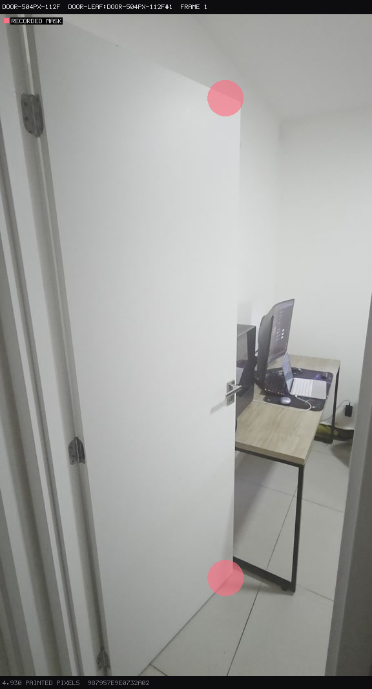
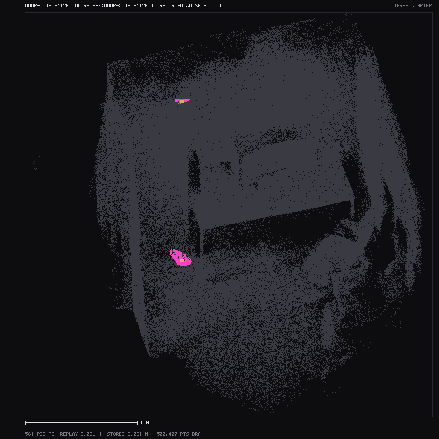

# Verge Studio

Verge Studio is a research tool for measuring real-world heights from ordinary video.

Drop in a clip, sample frames on the local computer, reconstruct the scene with Depth Anything 3
on a Google Cloud GPU, and measure an object against a fitted ground plane. The interface keeps
the pipeline visible as a node graph rather than hiding the work behind one button.

**Video is the input, not photographs.** The model compares several views of one scene. A single
image does not engage that mechanism and gives badly wrong geometry.

This repository is currently shared privately for review. The model weights used by the cloud
service are for personal and research use and do not permit commercial use.

## What works now

- A local clip is probed and sampled by ffmpeg across its whole duration. The video itself is
  never uploaded; only the extracted frames are sent when Run is pressed.
- The optional Cloud Run service returns metric depth, camera poses, a 3D point cloud and the
  compact data needed to reproduce a measurement.
- The app shows the source frame, depth, 3D scene, camera path, fitted ground and measurement in
  linked panes.
- A user can paint endpoint evidence or ask the browser-local segmentation model for a proposal,
  inspect the selected points in 3D, record repeat trials and compare them with tape truth.
- Runs stay temporary until Save is pressed. Bucket-backed results survive service deletion for
  three days; a saved run is copied to `~/verge-runs`.
- The complete interface can be exercised against a bundled mock reconstruction with no cloud
  account, GPU or cost. A mock is labelled clearly and is never evidence about the loaded clip.

The present evidence does **not** establish accuracy across rooms, phones, camera paths, floor
visibility or outdoor terrain. Grass measurement is future work. Automatic selection has one
successful door attempt, not a measured failure or abstention rate.

## A measurement you can inspect

This pair replays one frozen door trial. The pink marks are the evidence painted on the original
frame; the second image is the matching selection and ruler in the reconstructed scene.

| Source-frame endpoint marks | Matching 3D ruler |
|---|---|
|  |  |

That trial reads **2.021 m** against a **2.100 m** tape measurement. It is one selected trial, not
a general accuracy claim. The frozen provenance, hashes and reproduction command are in
[`docs/evidence/door-measurement-replay.manifest.json`](docs/evidence/door-measurement-replay.manifest.json).

The primary indoor benchmark used three independently repainted trials per object at 504 px and
112 frames:

| Object | Tape truth | Mean result | Error | Same-sitting spread |
|---|---:|---:|---:|---:|
| Door | 2.100 m | 2.0197 m | -3.8% | 5.9 mm |
| Table | 0.750 m | 0.6983 m | -6.9% | 4.1 mm |
| Tower | 0.450 m | 0.4275 m | -5.0% | 0.9 mm |

The 1-6 mm spread is repeatability within one sitting, **not measurement uncertainty**. A separate
mask-free surface measurement found the same tabletop within 1.1 mm of the brush result, while
both remained about 5 cm below the tape truth. See [MEASUREMENTS.md](MEASUREMENTS.md) for the full
protocol, raw limitations and the settings comparison.

## Supported computers

| Platform | Status |
|---|---|
| macOS | Supported and checked with the clean-clone procedure below |
| Linux | Targeted by the included GitHub Actions workflow; the first hosted run must pass before this is called verified |
| Windows through WSL 2 | Experimental; use the Linux instructions |
| Native Windows | Not supported: the operational scripts require Bash and Unix command-line tools |

The browser needs WebGL 2. Browser-local segmentation uses WebGPU when the browser and GPU offer
it and otherwise reports that it is unavailable; it does not silently move that work to a server.

## Zero-cost first setup

### 1. Install the local prerequisites

- Git.
- Node.js **22.12 or newer and earlier than Node 27**, with npm 10 or newer. `.nvmrc` records the
  Node 22 baseline used by CI; the clean-clone check also runs on the development computer's Node
  26 installation.
- Python 3.12 for the lightweight server contract test. This does not install DA3 or its weights.
- ffmpeg and ffprobe on `PATH`.

On macOS, Homebrew is one way to install them:

```bash
brew install node@22 python@3.12 ffmpeg
```

On Ubuntu or WSL 2:

```bash
sudo apt update
sudo apt install git ffmpeg python3 python3-venv
```

Install Node 22 from your normal Node version manager or the official Node distribution. Confirm
the commands before continuing:

```bash
node --version
npm --version
python3 --version
ffmpeg -version
ffprobe -version
```

### 2. Install exactly the locked dependencies

From the repository root:

```bash
npm ci --prefix app
python3 -m venv .venv
./.venv/bin/python -m pip install --requirement requirements-dev.txt
```

### 3. Verify the checkout

```bash
VERGE_PY="$PWD/.venv/bin/python" ./scripts/verify.sh
```

This checks the documentation, fixture manifests, TypeScript, unit tests and the Python service
contract. The offline exercise below checks local frame extraction as well. Neither makes a cloud
request.

### 4. Start the app

```bash
npm run dev --prefix app
```

Open <http://127.0.0.1:5173>. The server binds only to the local computer.

### 5. Exercise the offline pipeline

Use any short local video, or make a four-second test clip:

```bash
DEMO_CLIP="${TMPDIR:-/tmp}/verge-demo.mp4"
ffmpeg -f lavfi -i "testsrc2=duration=4:size=640x360:rate=30" \
  -c:v mpeg4 -q:v 5 -y "${DEMO_CLIP}"
```

In the app:

1. In **Inspector > Clip**, browse to the test clip.
2. Press **Extract frames**. This is local ffmpeg work and costs nothing.
3. Switch the app to **Advanced** mode.
4. Under **GPU**, turn on **Mock as run target**.
5. Press **Run DA3 Depth**.
6. Confirm the result says **MOCK** and explains that the bundled reconstruction is not your clip.
7. Open Depth 2D, Viewport 3D, Graph, Objects and Runs to exercise the stored pipeline.

The mock deliberately returns the same bundled four-frame reconstruction for every input. It
tests the interface and local geometry; it does not run DA3 and must not be measured as your scene.

The recorded door runs may appear as unavailable in a clean clone. Their large NPZ and GLB payloads
are intentionally local-only; the tracked manifests and checksums preserve their provenance.

## Optional Google Cloud setup

Everything above is local and free. A real reconstruction is optional, requires your own Google
Cloud project, and can cost money. Do not use the maintainer's project or bucket names.

### What authentication does

The local control plane uses the account from `gcloud auth login`. Those credentials live in the
Google Cloud CLI configuration outside this repository. Local Application Default Credentials,
created by `gcloud auth application-default login`, are a separate mechanism and are not required
by this app.

Cloud Run uses a dedicated `verge-runtime` service account attached to the service. Google supplies
its short-lived credentials inside Cloud Run; no private-key JSON file is created or committed.
Do not create a service-account key for Verge Studio, and never paste an identity token into a
tracked file.

### 1. Install and sign in to gcloud

Install the [Google Cloud CLI](https://cloud.google.com/sdk/docs/install), then:

```bash
gcloud auth login
gcloud auth list
```

### 2. Choose names for resources you own

Project IDs and bucket names are globally unique. They are identifiers, not credentials.

```bash
export PROJECT_ID="your-unique-google-project-id"
export REGION="us-central1"
export VERGE_OUTPUT_BUCKET="your-unique-verge-runs-bucket"
```

The app and every cloud script refuse to use the cloud when these values are absent. Keep them in
your shell profile or a private local helper if desired; do not store tokens or credential JSON in
the repository.

### 3. Create and bill the project

If you do not already have a project:

```bash
gcloud projects create "${PROJECT_ID}" --name="Verge Studio"
gcloud billing accounts list
gcloud billing projects link "${PROJECT_ID}" --billing-account="YOUR_BILLING_ACCOUNT_ID"
```

An organisation may prevent project creation or require an administrator to attach billing. Use
an existing project you control in that case.

Enable the APIs used by the scripts:

```bash
gcloud services enable \
  run.googleapis.com \
  cloudbuild.googleapis.com \
  artifactregistry.googleapis.com \
  storage.googleapis.com \
  iam.googleapis.com \
  iamcredentials.googleapis.com \
  serviceusage.googleapis.com \
  --project="${PROJECT_ID}"
```

Cloud Run also needs NVIDIA L4 GPU quota in the selected region. Quota availability depends on the
account and region; do not assume a new project has it.

### 4. Create the private output path

```bash
./scripts/create-bucket.sh
```

This creates the named private bucket, a three-day deletion rule, local-browser CORS, and the
dedicated runtime service account with bucket-scoped writer and reader access. It does not deploy
or wake a GPU. Stored bytes can still incur a small Cloud Storage charge.

Now run the read-only readiness check:

```bash
./scripts/cloud-preflight.sh
```

It checks the active account, project, billing, APIs, bucket, runtime identity, metadata access and
visible GPU quota without deploying or contacting a service. It cannot prove every create/delete
permission without changing the project, so it names that remaining boundary explicitly.

### 5. Run one paid cloud session safely

Plan all experiments before deploying so they share one warm instance.

```bash
./scripts/deploy.sh
```

Deployment creates or reuses an Artifact Registry image and starts a private Cloud Run service with
one L4 GPU. A source change under `server/` causes a roughly 12 GB rebuild. Open the app with the
same `PROJECT_ID`, `REGION` and `VERGE_OUTPUT_BUCKET` still exported; **Cloud control** will find the
service and attach short-lived authentication inside the local server.

After the needed runs:

1. Save any result you want to keep from the Runs pane.
2. Confirm bucket publication succeeded. A degraded run marked with a warning exists only on the
   instance and must be saved before teardown.
3. Delete the service:

```bash
./scripts/teardown.sh
```

Cloud Run bills the instance lifetime while it is warm, including startup and idle time. Deleting
the service is what ends that exposure. Teardown keeps one approximately 12 GB image so the next
session can skip a long rebuild; at the August 2026 measured size and price this is roughly one US
dollar per month. It also leaves the private bucket, whose transient run objects expire after
three days.

When the project is finished permanently:

```bash
PURGE_IMAGE=1 ./scripts/teardown.sh
```

That removes the service and Artifact Registry repository. Review and remove the bucket separately
only after saving anything you need.

## Data and security boundaries

- The source video stays on the local computer. Extracted JPEG frames are uploaded only for a real
  run after **Run DA3 Depth** is pressed.
- Dropped clips and extracted frames live under the operating system's temporary directory and are
  swept after one day. Saved runs live under `~/verge-runs`, outside the repository.
- Cloud results use a private bucket and signed links that expire after twelve hours. The objects
  themselves expire after three days.
- The local server binds to loopback and protects privileged API requests with a random token made
  for that process. Do not expose the development server with Vite's `--host` option.
- `.env` files, credentials, model weights, videos, live manifests and local inspection output are
  ignored. Ignore rules do not remove a secret already committed: revoke it and inspect Git history
  if that ever happens.

## Troubleshooting

**Node is rejected before installation.** Use the Node 22 version recorded in `.nvmrc`. Versions
before 22.12 and future versions from Node 27 onward are not claimed as compatible.

**ffmpeg or ffprobe is missing.** Install both with the platform package manager and confirm each
is on `PATH`. The app reports a platform-neutral error rather than assuming Homebrew.

**Port 5173 is occupied.** Choose another loopback port:

```bash
export PORT=5174
npm run dev --prefix app
```

Before using cloud artifacts on that port, update the bucket's allowed origins:

```bash
export VERGE_CORS_ORIGINS="http://127.0.0.1:5174,http://localhost:5174"
./scripts/create-bucket.sh
```

**Cloud control says unconfigured.** Export `PROJECT_ID`, `REGION` and `VERGE_OUTPUT_BUCKET` in the
same shell that starts the app.

**Preflight reports authentication missing.** Run `gcloud auth login`, then confirm the active
account with `gcloud auth list`. Do not substitute a downloaded service-account key.

**The project is ready but deploy fails on GPU quota.** Check Cloud Run L4 quota in the selected
region or request quota in a region where Cloud Run GPUs are available. No script can grant quota.

## Repository map

| Directory | What it holds |
|---|---|
| `app/` | React, TypeScript, Vite, docked panes, node graph and 3D viewport |
| `server/` | FastAPI wrapper around DA3 and the GPU container image |
| `geometry/` | Ground fitting, scale checks, back-projection and measurement |
| `fixtures/` | Small tracked mock data plus manifests for larger local evidence |
| `scripts/` | Verification, inspection, frame extraction and cloud lifecycle tools |
| `docs/evidence/` | Cleared review images and their machine-readable provenance |
| `donor/` | Read-only predecessor references; application code never imports them |

## Project records

| Question | Document |
|---|---|
| How should work be done here? | [AGENTS.md](AGENTS.md) |
| What is verified, and why was it built that way? | [docs/REGISTRY.md](docs/REGISTRY.md) |
| What remains to do? | [docs/TASK.md](docs/TASK.md) |
| What was measured against tape? | [MEASUREMENTS.md](MEASUREMENTS.md) |
| What must the interface look like and do? | [docs/DESIGN.md](docs/DESIGN.md) |
| Which external sources support the technical claims? | [docs/SOURCES.md](docs/SOURCES.md) |
